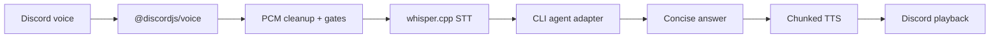

# VerbalCoding

<p align="center">
  <strong>Discord 음성으로 CLI 코딩 에이전트와 통화하듯 작업하세요.</strong>
</p>

<p align="center">
  <a href="../../README.md">English</a> ·
  <a href="README.ko.md">한국어</a> ·
  <a href="README.ja.md">日本語</a> ·
  <a href="README.zh.md">中文</a> ·
  <a href="README.es.md">Español</a> ·
  <a href="README.fr.md">Français</a> ·
  <a href="README.ru.md">Русский</a>
</p>

<p align="center">
  
  
  
  
</p>

<p align="center">
  
</p>

## Why

VerbalCoding은 Discord 음성 채널을 코딩 에이전트용 핸즈프리 조작면으로 바꿉니다. 말로 요청하고, CLI 에이전트가 작업하게 두고, 핵심 답변을 음성으로 다시 들을 수 있습니다 — 텍스트 기록, 진행 이벤트, 코드/로그 낭독 방지 장치까지 함께 제공합니다.

## 핵심 기능

| 제공 기능 | 좋은 이유 |
|---|---|
| 음성 우선 에이전트 제어 | Hermes Agent, Claude Code, Codex, Gemini CLI, OpenCode, OpenClaw 또는 커스텀 CLI를 말로 제어합니다. |
| 로컬 우선 음성 루프 | Discord 음성 캡처 → `whisper.cpp` STT → 에이전트 → 분할 TTS 재생. |
| 음성 + 텍스트 컨텍스트 공유 | 지원되는 에이전트에서는 음성 턴과 `!ask` 텍스트 명령이 같은 세션을 재사용합니다. |
| 바지인과 감도 모드 | 재생 중 자연스럽게 끼어들고, 일반/보수 감도 모드를 전환합니다. |
| 다국어 음성 프리셋 | `vc language ko/en/auto`로 STT, 진행 언어, TTS 음성을 함께 바꿉니다. |
| 프로젝트별 멀티룸 격리 | 프로젝트 방마다 별도 봇과 Hermes 프로필, 세션, 메모리, 로그를 둡니다. |

## 빠른 시작

```bash
git clone git@github.com:ca1773130n/VerbalCoding.git
cd VerbalCoding
./scripts/install.sh
vc doctor
./run.sh
```

## 동작 방식



## 지원 에이전트 백엔드

| Backend | Default command | Session support |
|---|---:|---|
| Hermes Agent | `hermes chat -Q -q` | Resume, verbose progress, cancellation, final-answer recovery |
| Claude Code | `claude -p` | CLI session file support through adapter defaults |
| Codex CLI | `codex exec` | CLI session file support through adapter defaults |
| Gemini CLI | `gemini -p` | CLI session file support through adapter defaults |
| OpenCode | `opencode run` | CLI session file support through adapter defaults |
| OpenClaw | `openclaw run` | CLI session file support through adapter defaults |
| Custom | `AGENT_COMMAND` | Bring your own non-interactive command |

## 더 알아보기

| Guide | What you get |
|---|---|
| [Fresh Install](../FRESH_INSTALL.md) | 클린 클론 설치, 모델 다운로드, 첫 실행 |
| [Usage Guide](../USAGE.md) | CLI 명령, Discord 명령, 진행 모드, 지연 시간 지표 |
| [Configuration](../CONFIGURATION.md) | .env, 에이전트 백엔드, MCP, TTS 백엔드, 운영 노트 |
| [Multi-Instance](../MULTI_INSTANCE.md) | 프로젝트마다 영구 Discord 음성방 하나씩 |
| [Release Notes](../RELEASE.md) | 현재 기능과 릴리스 전 체크리스트 |

## 작은 명령 지도

```bash
vc status
vc language ko|en|auto
vc bot invite CLIENT_ID
vc instance setup NAME
vc instance start NAME
vc doctor
```

## 요구 사항

| Layer | Default |
|---|---|
| Runtime | Node.js 20+, npm |
| Audio | `ffmpeg` |
| STT | `whisper.cpp` / `whisper-cli` |
| Discord | Bot token, Message Content intent, voice permissions |
| Agent | At least one authenticated CLI harness, Hermes Agent by default |
| Platform focus | macOS / Apple Silicon currently gets the most testing |

## 기여

```bash
node --check app-node/main.mjs
npm test
bash -n run.sh scripts/install.sh
vc doctor
```

## 상태

VerbalCoding is public-release oriented but still early. Demo video/GIF, broader Linux notes, and a formal license file are still TODOs.
