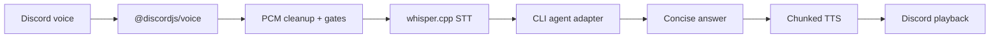

# VerbalCoding

<p align="center">
  <strong>Discord 음성으로 CLI 코딩 에이전트와 통화하듯 작업하세요.</strong>
</p>

<p align="center">
  <a href="../../README.md">English</a> ·
  <a href="README.ko.md">한국어</a> ·
  <a href="README.ja.md">日本語</a> ·
  <a href="README.zh.md">中文</a> ·
  <a href="README.es.md">Español</a> ·
  <a href="README.fr.md">Français</a> ·
  <a href="README.ru.md">Русский</a>
</p>

<p align="center">
  
  
  
  
  
</p>

<p align="center">
  
</p>

## 왜 필요한가

VerbalCoding은 Discord 음성 채널을 코딩 에이전트용 핸즈프리 조작면으로 바꿉니다. 말로 요청하고, CLI 에이전트가 작업하게 두고, 핵심 답변을 음성으로 다시 들을 수 있습니다. 텍스트 기록, 진행 이벤트, 코드/로그 낭독 방지 장치도 함께 제공합니다.

## 핵심 기능

| 제공 기능 | 좋은 이유 |
|---|---|
| 음성 우선 에이전트 제어 | Hermes Agent, Claude Code, Codex, Gemini CLI, OpenCode, OpenClaw 또는 커스텀 CLI를 말로 제어합니다. |
| 로컬 우선 음성 루프 | Discord 음성 캡처 → `whisper.cpp` STT → 에이전트 → 분할 TTS 재생. |
| 음성 + 텍스트 컨텍스트 공유 | 지원되는 에이전트에서는 음성 턴과 `!ask` 텍스트 명령이 같은 세션을 재사용합니다. |
| 끼어들기와 감도 모드 | 재생 중 자연스럽게 끼어들고, 일반/보수 감도 모드를 전환합니다. |
| 다국어 음성 프리셋 | `vc language ko/en/auto`로 STT, 진행 언어, TTS 음성을 함께 바꿉니다. |
| 프로젝트별 멀티룸 격리 | 프로젝트 방마다 별도 봇과 Hermes 프로필, 세션, 메모리, 로그를 둡니다. |

## 빠른 시작

가장 쉬운 npm 설치:

```bash
npm install -g verbalcoding
vc setup --yes
vc doctor
vc start
```

전역 설치 없이 바로 실행:

```bash
npx verbalcoding setup --yes
vc doctor
vc start
```

기여자용 GitHub 클론:

```bash
git clone https://github.com/ca1773130n/VerbalCoding.git
cd VerbalCoding
./scripts/install.sh --yes
vc doctor
./run.sh
```

`vc setup --yes`와 `./scripts/install.sh --yes`는 가능한 경우 Node/npm 의존성, `ffmpeg`, `whisper-cli`, 기본 whisper.cpp 모델, 로컬 `.venv-tts` Edge TTS helper를 준비합니다. macOS/Homebrew와 일반적인 Linux 패키지 매니저(`apt`, `dnf`, `pacman`)를 지원합니다.

## 동작 방식



## 지원 에이전트 백엔드

| 백엔드 | 기본 명령 | 세션 지원 |
|---|---:|---|
| Hermes Agent | `hermes chat -Q -q` | resume, 자세한 진행, cancellation, 최종 답변 복구 |
| Claude Code | `claude -p` | 어댑터 기본값을 통한 CLI 세션 파일 지원 |
| Codex CLI | `codex exec` | 어댑터 기본값을 통한 CLI 세션 파일 지원 |
| Gemini CLI | `gemini -p` | 어댑터 기본값을 통한 CLI 세션 파일 지원 |
| OpenCode | `opencode run` | 어댑터 기본값을 통한 CLI 세션 파일 지원 |
| OpenClaw | `openclaw run` | 어댑터 기본값을 통한 CLI 세션 파일 지원 |
| Custom | `AGENT_COMMAND` | 비대화형 명령을 직접 연결 |

## 더 알아보기

| 문서 | 내용 |
|---|---|
| [새 설치](FRESH_INSTALL.ko.md) | npm 설치, 클린 클론, 모델 다운로드, 첫 실행 |
| [사용 가이드](USAGE.ko.md) | CLI 명령, Discord 명령, 진행 모드, 지연 시간 지표 |
| [설정](CONFIGURATION.ko.md) | `.env`, 에이전트 백엔드, MCP, TTS 백엔드, 운영 메모 |
| [멀티 인스턴스](MULTI_INSTANCE.ko.md) | 프로젝트마다 영구 Discord 음성방 하나씩 운영 |
| [릴리스 노트](RELEASE.ko.md) | 현재 기능과 릴리스 전 체크리스트 |
| [English docs](../../README.md) | 영어 canonical README와 문서 |

## 작은 명령 지도

```bash
vc status                 # 현재 언어, TTS, 브릿지 설정 보기
vc language ko|en|auto    # STT/진행/TTS 언어 프리셋 전환
vc bot invite CLIENT_ID   # Discord 봇 초대 URL 생성
vc instance setup NAME    # 격리된 프로젝트 음성 봇 생성
vc instance start NAME    # 해당 봇을 백그라운드로 실행
vc doctor                 # 비밀값을 숨긴 상태 점검
vc start                  # 기본 브릿지 시작
```

Discord에서:

```text
!join        !ask <prompt>       !verbose on/off
!latency     !sensitivity normal !sensitivity conservative
!session new <name> <workdir> [context] --voice <voice-channel>
```

## 요구 사항

| 계층 | 기본값 |
|---|---|
| Runtime | Node.js 20+, npm; 설치 스크립트가 Homebrew/apt/dnf/pacman으로 설치 시도 |
| Audio | `ffmpeg`; 설치 스크립트가 설치 시도 |
| STT | `whisper.cpp` / `whisper-cli`; macOS는 Homebrew, Linux는 로컬 빌드 fallback |
| TTS | Edge TTS CLI; 필요하면 `.venv-tts` 생성 |
| Discord | Bot token, Message Content intent, voice permissions |
| Agent | 인증된 CLI 하네스 하나 이상; 기본은 Hermes Agent |
| Platform focus | macOS / Apple Silicon을 가장 많이 테스트; Linux bootstrap은 best-effort |

## 기여

변경 전 가벼운 검증:

```bash
node --check app-node/main.mjs
npm test
bash -n run.sh scripts/install.sh
npm pack --dry-run
vc doctor
```

## 상태

VerbalCoding은 공개 릴리스를 지향하지만 아직 초기 단계입니다. 데모 영상/GIF, 더 넓은 Linux 검증, CI와 보안 리뷰를 계속 보강하면 좋습니다.
