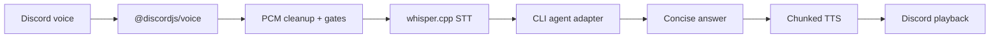

# VerbalCoding

<p align="center">
  <strong>通过 Discord 语音像打电话一样控制 CLI 编程 Agent。</strong>
</p>

<p align="center">
  <a href="../../README.md">English</a> ·
  <a href="README.ko.md">한국어</a> ·
  <a href="README.ja.md">日本語</a> ·
  <a href="README.zh.md">中文</a> ·
  <a href="README.es.md">Español</a> ·
  <a href="README.fr.md">Français</a> ·
  <a href="README.ru.md">Русский</a>
</p>

<p align="center">
  
  
  
  
</p>

<p align="center">
  
</p>

## Why

VerbalCoding 把 Discord 语音频道变成面向编程 Agent 的免手动控制台。你可以直接说出需求，让 CLI Agent 工作，再听到简洁的语音回答；同时保留文字记录、进度事件，并避免把大段代码或日志读出来。

## 亮点

| 能力 | 价值 |
|---|---|
| 语音优先的 Agent 控制 | 用语音控制 Hermes Agent、Claude Code、Codex、Gemini CLI、OpenCode、OpenClaw 或自定义 CLI。 |
| 本地优先语音闭环 | Discord 语音捕获 → `whisper.cpp` STT → Agent → 分段 TTS 播放。 |
| 语音 + 文本共享上下文 | 在支持的 Agent 中，语音轮次和 `!ask` 文本命令可复用同一会话。 |
| 打断与灵敏度模式 | 可自然打断播放，并在普通/保守灵敏度之间切换。 |
| 多语言语音预设 | 用 `vc language ko/en/auto` 同步切换 STT、进度语言和 TTS 声音。 |
| 按项目隔离的多房间 | 每个项目房间使用独立 Bot、Hermes profile、会话、记忆和日志。 |

## 快速开始

```bash
git clone git@github.com:ca1773130n/VerbalCoding.git
cd VerbalCoding
./scripts/install.sh
vc doctor
./run.sh
```

## 工作原理



## 支持的 Agent 后端

| Backend | Default command | Session support |
|---|---:|---|
| Hermes Agent | `hermes chat -Q -q` | Resume, verbose progress, cancellation, final-answer recovery |
| Claude Code | `claude -p` | CLI session file support through adapter defaults |
| Codex CLI | `codex exec` | CLI session file support through adapter defaults |
| Gemini CLI | `gemini -p` | CLI session file support through adapter defaults |
| OpenCode | `opencode run` | CLI session file support through adapter defaults |
| OpenClaw | `openclaw run` | CLI session file support through adapter defaults |
| Custom | `AGENT_COMMAND` | Bring your own non-interactive command |

## 了解更多

| Guide | What you get |
|---|---|
| [Fresh Install](../FRESH_INSTALL.md) | 干净克隆安装、模型下载、首次运行 |
| [Usage Guide](../USAGE.md) | CLI 命令、Discord 命令、进度模式、延迟指标 |
| [Configuration](../CONFIGURATION.md) | .env、Agent 后端、MCP、TTS 后端、运维说明 |
| [Multi-Instance](../MULTI_INSTANCE.md) | 每个项目一个常驻 Discord 语音房间 |
| [Release Notes](../RELEASE.md) | 当前能力与发布前检查清单 |

## 常用命令

```bash
vc status
vc language ko|en|auto
vc bot invite CLIENT_ID
vc instance setup NAME
vc instance start NAME
vc doctor
```

## 要求

| Layer | Default |
|---|---|
| Runtime | Node.js 20+, npm |
| Audio | `ffmpeg` |
| STT | `whisper.cpp` / `whisper-cli` |
| Discord | Bot token, Message Content intent, voice permissions |
| Agent | At least one authenticated CLI harness, Hermes Agent by default |
| Platform focus | macOS / Apple Silicon currently gets the most testing |

## 贡献

```bash
node --check app-node/main.mjs
npm test
bash -n run.sh scripts/install.sh
vc doctor
```

## 状态

VerbalCoding is public-release oriented but still early. Demo video/GIF, broader Linux notes, and a formal license file are still TODOs.
