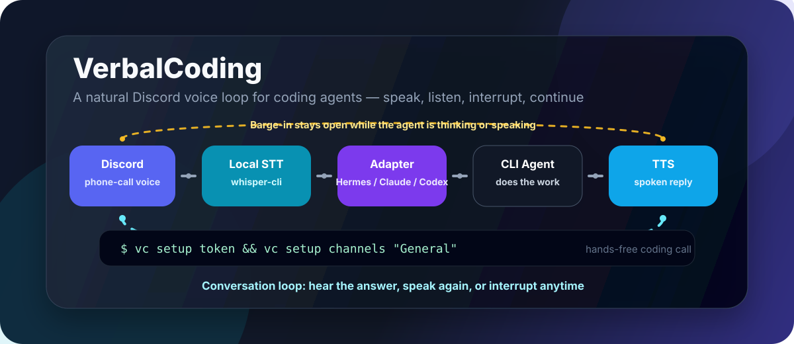

# VerbalCoding

<p align="center">
  <strong>通过 Discord 语音与 CLI 编码代理对话——就像给软件工作打一通电话。</strong>
</p>

<p align="center">
  <a href="README.ko.md">한국어</a> ·
  <a href="README.ja.md">日本語</a> ·
  <a href="README.zh.md">中文</a> ·
  <a href="README.es.md">Español</a> ·
  <a href="README.fr.md">Français</a> ·
  <a href="README.ru.md">Русский</a>
</p>

<p align="center">
  
  
  
  
  
</p>

<p align="center">
  
</p>

## 为什么需要它

VerbalCoding 会把 Discord 语音频道变成编码代理的免手动控制面板。说出请求，让你的 CLI 代理执行工作，然后听到简洁的语音回复——同时保留文本转写、进度事件，以及针对嘈杂代码/日志输出的保护机制。

## 亮点

| 你能获得什么 | 为什么体验很好 |
|---|---|
| 语音优先的代理控制 | 可以与 Hermes Agent、Claude Code、Codex、Gemini CLI、OpenCode、OpenClaw 或任何自定义 CLI 驱动对话。 |
| 本机语音闭环 | Discord 语音采集 → 本地 `whisper-cli` 转写 → 代理 → 分块 TTS 播放。 |
| 共享语音 + 文本上下文 | 语音轮次和 `!ask` 文本命令可以复用同一个受支持的代理会话。 |
| 插话和灵敏度模式 | 可以自然打断播放，并在普通环境与保守/嘈杂环境之间切换。 |
| 多语言语音预设 | 使用 `vc language ko/en/auto` 同时切换 STT、进度语言和 TTS 声音。 |
| 多房间项目隔离 | 每个项目房间运行一个机器人，并隔离 Hermes 配置、会话、记忆和日志。 |

## 快速开始

使用 npm 的最快路径：

```bash
npm install -g verbalcoding
vc setup --yes
vc doctor
vc start
```

或者无需永久全局安装，直接运行：

```bash
npx verbalcoding setup --yes
vc doctor
vc start
```

贡献者的 GitHub 克隆路径：

```bash
git clone https://github.com/ca1773130n/VerbalCoding.git
cd VerbalCoding
./scripts/install.sh --yes
vc doctor
./run.sh
```

`vc setup --yes` 会通过 npm 包内置的安装器引导安装本地前置依赖。`./scripts/install.sh --yes` 只在 GitHub 克隆目录中执行同样的流程。两者都会在可行时处理 Node/npm 依赖、`ffmpeg`、`whisper-cli`、默认 whisper.cpp 模型、本地 `.venv-tts` Edge TTS 辅助环境以及设置向导配置。它们支持 macOS/Homebrew 以及常见 Linux 包管理器（`apt`、`dnf`、`pacman`）；如只想安装依赖而不运行向导，可用 `--no-wizard` 重新运行；如果想自行安装 OS 软件包，可用 `--skip-system`。

需要干净安装演练？从[全新安装](FRESH_INSTALL.zh.md)开始。

## 支持的代理后端

| 后端 | 默认命令 | 会话支持 |
|---|---:|---|
| Hermes Agent | `hermes chat -Q -q` | 恢复、详细进度、取消、最终答案恢复 |
| Claude Code | `claude -p` | 通过适配器默认值支持 CLI 会话文件 |
| Codex CLI | `codex exec` | 通过适配器默认值支持 CLI 会话文件 |
| Gemini CLI | `gemini -p` | 通过适配器默认值支持 CLI 会话文件 |
| OpenCode | `opencode run` | 通过适配器默认值支持 CLI 会话文件 |
| OpenClaw | `openclaw run` | 通过适配器默认值支持 CLI 会话文件 |
| Custom | `AGENT_COMMAND` | 自带非交互式命令 |

## 了解更多

| 指南 | 你能获得什么 |
|---|---|
| [全新安装](FRESH_INSTALL.zh.md) | 干净克隆设置、模型下载、首次运行 |
| [使用指南](USAGE.zh.md) | CLI 命令、Discord 命令、进度模式、延迟指标 |
| [配置](CONFIGURATION.zh.md) | `.env`、代理后端、MCP、TTS 后端、运维说明 |
| [多实例](MULTI_INSTANCE.zh.md) | 每个项目一个长期 Discord 语音房间 |
| [发行说明](RELEASE.zh.md) | 当前能力和预发布检查清单 |

## 精简命令地图

```bash
vc status                 # 当前语言、TTS 和桥接设置
vc language ko|en|auto    # 切换 STT/进度/TTS 语言预设
vc bot invite CLIENT_ID   # 生成 Discord 机器人邀请 URL
vc instance setup NAME    # 创建隔离的项目语音机器人
vc instance start NAME    # 在后台运行该机器人
vc doctor                 # 脱敏健康检查
vc start                  # 启动默认桥接
```

在 Discord 中：

| 命令 | 作用 |
|---|---|
| `!join` | 加入你当前的语音频道。 |
| `!ask <prompt>` | 将文本发送给同一个代理后端。 |
| `!verbose on\|off` | 显示/朗读简短进度更新。 |
| `!latency` | 汇总最近的语音/STT/代理/TTS 延迟。 |
| `!sensitivity normal` | 使用普通室内插话灵敏度。 |
| `!sensitivity conservative` | 使用更严格的嘈杂/户外灵敏度。 |
| `!session new <name> <workdir> [context] --voice <voice-channel>` | 将项目会话绑定到语音房间。 |

## 要求

| 层 | 默认值 |
|---|---|
| 运行时 | Node.js 20+、npm；安装脚本可通过 Homebrew/apt/dnf/pacman 安装 |
| 音频 | `ffmpeg`；安装脚本可安装它 |
| 语音识别 | 来自 whisper.cpp 的本地 `whisper-cli`；安装脚本在 macOS 使用 Homebrew，在 Linux 使用本地构建回退 |
| TTS | Edge TTS CLI；安装脚本会在需要时创建 `.venv-tts` |
| Discord | 机器人令牌、Message Content intent、语音权限 |
| 代理 | 至少一个已认证的 CLI 驱动，默认是 Hermes Agent |
| 平台重点 | macOS / Apple Silicon 测试最多；Linux 引导为尽力支持并已文档化 |

## 贡献

提交更改前运行轻量检查：

```bash
node --check app-node/main.mjs
npm test
bash -n run.sh scripts/install.sh
npm pack --dry-run
vc doctor
```

## 状态

VerbalCoding 面向公开发布，但仍处于早期阶段。演示视频/GIF、更广泛的 Linux 验证、CI，以及更深入的安全审查仍在 TODO 中。
